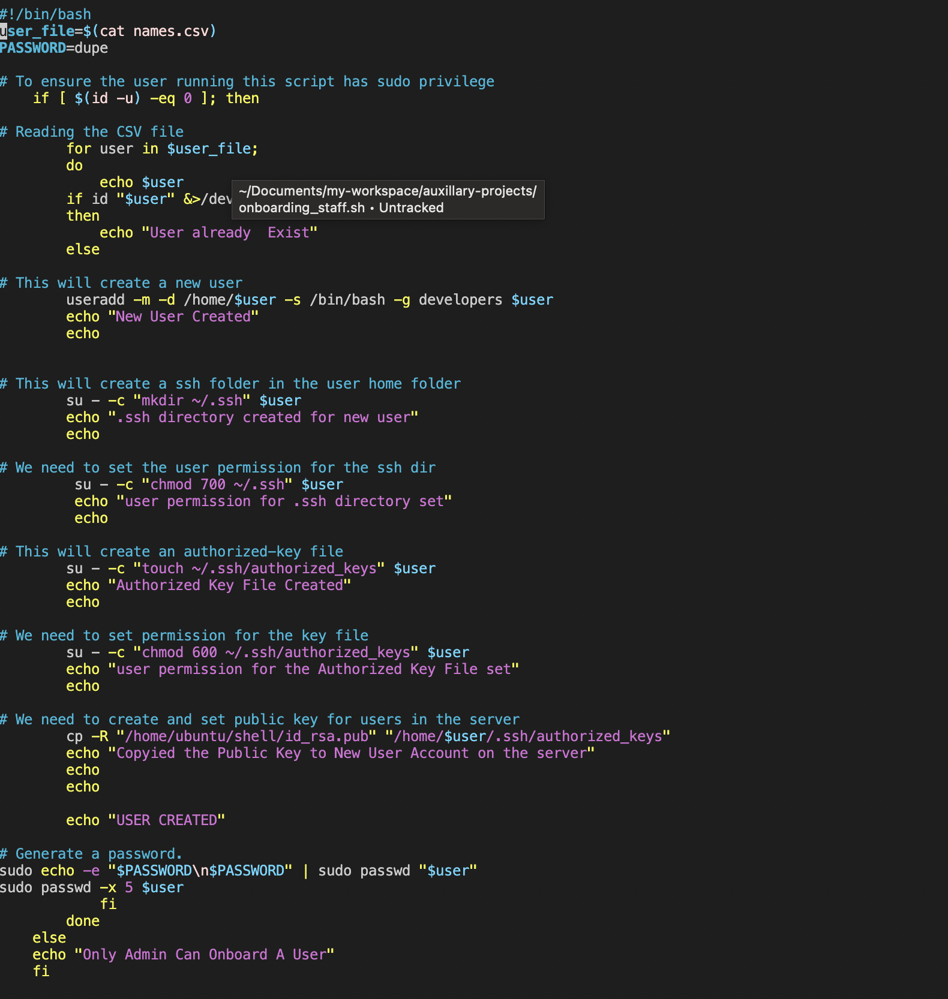

# DOCUMENTAION OF AUXILARY PROJECT1 ON SHELL SCRIP
`mkdir shell`

`cd Shell`

`touch names.csv`

`vim names.csv`

`vi onboarding_staff.sh`

`scp -i 4k4y.pem onboarding_staff.sh ubuntu@3.95.162.57:~/;`

`touch id_rsa.pub`

`vi id_rsa`

`sudo groupadd developers`

`ls -l /home/`

`sudo chmod +x onboarding_staff.sh`

`./onboarding_staff.sh`

`ls -l /home/`

`./onboarding_staff.sh`

`ssh -i developkey.pem Abebi@3.95.162.57`

`exit`

`sudo su`

`ssh -i developkey.pem Aremu@3.95.162.57`

